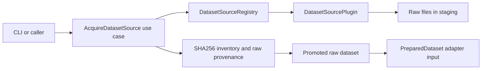
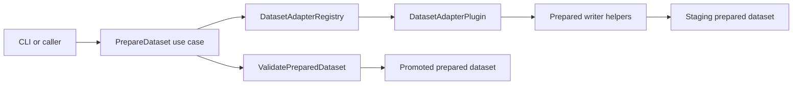

# Architecture

Industrial TSAD Eval uses a hexagonal architecture to keep product logic
independent from command-line rendering and filesystem details.

## Layers

- `domain` contains stable contracts and pure evaluation behavior.
- `ports` defines the interfaces that application services depend on.
- `application` coordinates use cases and owns workflow-level decisions.
- `infrastructure` implements local repositories and artifact writers.
- `plugins` provides dataset source, dataset adapter, detector, and provider implementations.
- `interfaces/cli` is the only layer that imports Typer or Rich.

## Dependency Rules

- Domain code imports no application, infrastructure, plugin, or interface code.
- Application code depends on domain, ports, and selected infrastructure adapters.
- Plugins implement ports and are discovered through registries.
- CLI code performs argument parsing and rendering only.
- Core code raises Python/domain exceptions; CLI code translates them to exit codes.
- Optional torch imports stay inside torch plugin/model/helper modules.
- Optional acquisition dependencies are imported lazily inside acquisition helpers.
- Raw acquisition writes to a staging directory, records provenance, then promotes
  the result. Source plugins do not delete output trees directly.
- Dataset preparation writes to a staging directory, validates Prepared Format v1,
  then promotes the result. Adapters never delete existing outputs directly.

## Dataset Acquisition Flow

Acquisition owns localization only. Preparation remains an explicit next step so
benchmarks and scoring never trigger hidden downloads or raw-data mutation.

## Dataset Preparation Flow

The adapter owns source-specific parsing. The application service owns plugin
lookup, staging, overwrite policy, validation, and promotion.

## Benchmark Slice

Benchmark orchestration is in-process. `RunBenchmark` loads a resolved TOML
config, expands datasets x detectors x protocols, validates prepared datasets,
then calls the existing scoring and evaluation use cases.

Benchmark runs consume Prepared Format directories only. Raw-data preparation
stays explicit through `itse prepared prepare`, which keeps benchmark runs
repeatable and avoids hidden data mutation.

## System And Profiling Slice

System diagnostics are read-only probes that produce structured JSON reports.
Profiling wraps existing application services and writes measured artifacts
beside the normal score/evaluation outputs. It does not add a second scoring or
evaluation path.

## Evidence And XAI Slice

Evidence generation consumes prepared data, score artifacts, and optional
evaluation matches. It writes Evidence Bundle v1 through a repository adapter.
XAI evaluation then consumes those bundles plus a GT tag map to compute
HitRate@K, Recall@K, masking proxy drops, and local stability.

Detector-native explainers are optional detector capabilities. Score runs write
native explanation parquet files beside Score Contract v1 outputs when a fitted
detector implements the explainer port. Evidence generation can require native
explanations, use them automatically, or fall back to the deterministic robust
baseline for detector families such as Forecast Ridge.

## Operator Card Slice

Operator cards sit above Evidence Bundle v1. The application retrieves evidence
chunks, optionally adds local Markdown playbooks, and renders deterministic JSON
and Markdown cards with citations.

This slice has no LLM provider, network, replay-suite, or referee dependency.
It is an application workflow, not a detector or dataset plugin.

## assistant replay And Reproduction Slice

The assistant replay harness is the thesis-compatible assistant experiment. It depends on
ports for provider-backed generation, evidence retrieval, replay-suite storage,
assistant run artifacts, and metric writing. `llama.cpp` is the recommended
local reproducibility provider, while cloud providers are configured through the
same `LLMProvider` port.

`RunThesisReproduction` composes benchmark, evidence, XAI, optional profiling,
and assistant replay stages in process. It writes a crosswalk that maps thesis-era artifacts
to the productized contracts without importing old thesis modules.
