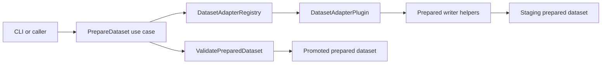

# Architecture

Industrial TSAD Eval uses a hexagonal architecture to keep product logic
independent from command-line rendering and filesystem details.

## Layers

- `domain` contains stable contracts and pure evaluation behavior.
- `ports` defines the interfaces that application services depend on.
- `application` coordinates use cases and owns workflow-level decisions.
- `infrastructure` implements local repositories and artifact writers.
- `plugins` provides dataset adapter and detector implementations through registries.
- `interfaces/cli` is the only layer that imports Typer or Rich.

## Dependency Rules

- Domain code imports no application, infrastructure, plugin, or interface code.
- Application code depends on domain, ports, and selected infrastructure adapters.
- Plugins implement ports and are discovered through registries.
- CLI code performs argument parsing and rendering only.
- Core code raises Python/domain exceptions; CLI code translates them to exit codes.
- Optional torch imports stay inside torch plugin/model/helper modules.
- Dataset preparation writes to a staging directory, validates Prepared Format v1,
  then promotes the result. Adapters never delete existing outputs directly.

## Dataset Preparation Flow

The adapter owns source-specific parsing. The application service owns plugin
lookup, staging, overwrite policy, validation, and promotion.

## Benchmark Slice

Benchmark orchestration is in-process. `RunBenchmark` loads a resolved TOML
config, expands datasets x detectors x protocols, validates prepared datasets,
then calls the existing scoring and evaluation use cases.

Benchmark runs consume Prepared Format directories only. Raw-data preparation
stays explicit through `itse prepared prepare`, which keeps benchmark runs
repeatable and avoids hidden data mutation.

## System And Profiling Slice

System diagnostics are read-only probes that produce structured JSON reports.
Profiling wraps existing application services and writes measured artifacts
beside the normal score/evaluation outputs. It does not add a second scoring or
evaluation path.

## Evidence And XAI Slice

Evidence generation consumes prepared data, score artifacts, and optional
evaluation matches. It writes Evidence Bundle v1 through a repository adapter.
XAI evaluation then consumes those bundles plus a GT tag map to compute
HitRate@K, Recall@K, masking proxy drops, and local stability.

Detector-native explainers are intentionally outside this slice. The current
implementation is deterministic and detector-agnostic.
