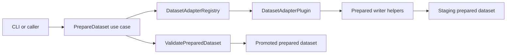

# Architecture

Industrial TSAD Eval uses a hexagonal architecture to keep product logic
independent from command-line rendering and filesystem details.

## Layers

- `domain` contains stable contracts and pure evaluation behavior.
- `ports` defines the interfaces that application services depend on.
- `application` coordinates use cases and owns workflow-level decisions.
- `infrastructure` implements local repositories and artifact writers.
- `plugins` provides dataset adapter and detector implementations through registries.
- `interfaces/cli` is the only layer that imports Typer or Rich.

## Dependency Rules

- Domain code imports no application, infrastructure, plugin, or interface code.
- Application code depends on domain, ports, and selected infrastructure adapters.
- Plugins implement ports and are discovered through registries.
- CLI code performs argument parsing and rendering only.
- Core code raises Python/domain exceptions; CLI code translates them to exit codes.
- Dataset preparation writes to a staging directory, validates Prepared Format v1,
  then promotes the result. Adapters never delete existing outputs directly.

## Dataset Preparation Flow

The adapter owns source-specific parsing. The application service owns plugin
lookup, staging, overwrite policy, validation, and promotion.

## First Vertical Slice

The first slice supports:

1. Generate a synthetic OPC-UA-like Prepared Format dataset.
2. Validate the prepared dataset.
3. Train and run the ForecastRidge detector plugin.
4. Validate Score Contract artifacts.
5. Evaluate event-level metrics and write JSON artifacts.

This creates a small but complete path that later dataset and detector plugins
can reuse without changing the application layer.

## Dataset Adapter Slice

The second slice adds local raw-data adapters for TEP, SWaT, HAI, and HAI-CPPS.
All adapters produce the same Prepared Format v1 contract and are invoked
through `PrepareDataset`, not directly from the CLI. Optional readers for MAT,
RData, and Excel files are isolated behind the `datasets` extra.
