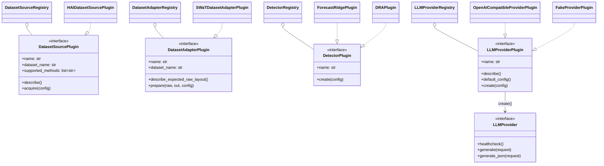
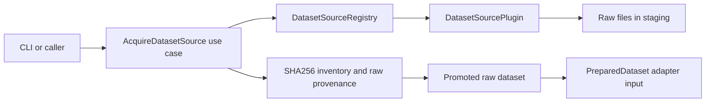
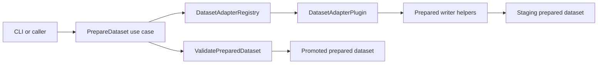

# Architecture

Industrial TSAD Eval uses a hexagonal architecture to keep product logic
independent from command-line rendering and filesystem details.

## Layers

- `domain` (`src/industrial_tsad_eval/domain/`) contains stable contracts and pure evaluation behavior.
- `ports` (`src/industrial_tsad_eval/ports/`) defines the interfaces that application services depend on.
- `application` (`src/industrial_tsad_eval/application/`) coordinates use cases and owns workflow-level decisions.
- `infrastructure` (`src/industrial_tsad_eval/infrastructure/`) implements local repositories and artifact writers.
- `plugins` (`src/industrial_tsad_eval/plugins/`) provides dataset source, dataset adapter, detector, and provider implementations.
- `interfaces/cli` (`src/industrial_tsad_eval/interfaces/cli/main.py`) is the only layer that imports Typer or Rich.

## Component Overview

The class diagram below shows the four port protocols, the registries that hold
their implementations, and one or two representative plugins per port. All edges
correspond to actual import / realization relationships in the codebase; the
registries are constructed by `default_*_registry()` helpers in
`src/industrial_tsad_eval/plugins/registry.py` and
`src/industrial_tsad_eval/plugins/providers.py`.

Port definitions live in `src/industrial_tsad_eval/ports/dataset_sources.py:11`,
`ports/dataset_adapters.py:11`, `ports/detectors.py:40`, and `ports/llm.py:18`/`:35`.
Registry classes are at `plugins/registry.py:14`/`:39`/`:64` and
`plugins/providers.py:29`. Representative implementations:
`plugins/sources/hai.py:11`, `plugins/datasets/swat.py:28`,
`plugins/forecast_ridge.py:124`, `plugins/torch_detectors.py:653`,
`plugins/providers.py:151`, `plugins/providers.py:54`.

## Dependency Rules

- Domain code imports no application, infrastructure, plugin, or interface code.
- Application code depends on domain, ports, and selected infrastructure adapters.
- Plugins implement ports and are discovered through registries.
- CLI code performs argument parsing and rendering only — enforced by
  `tests/test_architecture.py:80` (no `typer`/`rich` outside `interfaces/cli/`).
- Core code raises Python/domain exceptions; CLI code translates them to exit codes.
- Optional torch imports stay inside torch plugin/model/helper modules — enforced
  by `tests/test_architecture.py:121`.
- Optional acquisition dependencies are imported lazily inside acquisition helpers
  (`tests/test_architecture.py:160` for `kagglehub`,
  `tests/test_architecture.py:141` for `psutil`/`pynvml`,
  `tests/test_architecture.py:202` for provider SDKs).
- Raw acquisition writes to a staging directory, records provenance, then promotes
  the result. Source plugins do not delete output trees directly — enforced by
  `tests/test_architecture.py:221`.
- Dataset preparation writes to a staging directory, validates Prepared Format v1,
  then promotes the result. Adapters never delete existing outputs directly —
  enforced by `tests/test_architecture.py:110`.

## Dataset Acquisition Flow

The use case is `AcquireDatasetSource` (`src/industrial_tsad_eval/application/acquisition.py:69`).
It writes a SHA256 inventory and `raw_provenance.json` via
`infrastructure/acquisition.py:92`/`:117` before promoting the staged tree.

Acquisition owns localization only. Preparation remains an explicit next step so
benchmarks and scoring never trigger hidden downloads or raw-data mutation.

## Dataset Preparation Flow

The use case is `PrepareDataset` (`src/industrial_tsad_eval/application/preparation.py:15`).
It calls writer helpers in `infrastructure/prepared_writer.py:13` and validates
the staged output through `ValidatePreparedDataset` (`application/validation.py:20`).

The adapter owns source-specific parsing. The application service owns plugin
lookup, staging, overwrite policy, validation, and promotion.

## Benchmark Slice

Benchmark orchestration is in-process. `RunBenchmark`
(`src/industrial_tsad_eval/application/benchmark.py:75`) loads a resolved TOML
config (`infrastructure/benchmark_config.py:39`), expands datasets x detectors x
protocols, validates prepared datasets, then calls `ScoreRuns`
(`application/scoring.py:29`) and `EvaluateScores` (`application/evaluation.py:40`).

Benchmark runs consume Prepared Format directories only. Raw-data preparation
stays explicit through `itse prepared prepare`, which keeps benchmark runs
repeatable and avoids hidden data mutation.

## System And Profiling Slice

System diagnostics are read-only probes (`infrastructure/system.py:84`,
`:96`, `:136`) that produce structured JSON reports through `RunPreflight`
(`application/preflight.py:34`). Profiling wraps existing application services
through `ProfileScoreEvaluate` (`application/profiling.py:42`) and `StageMonitor`
(`infrastructure/profiling.py:19`), writing measured artifacts beside the normal
score/evaluation outputs. It does not add a second scoring or evaluation path.

## Evidence And XAI Slice

Evidence generation (`GenerateEvidence`,
`src/industrial_tsad_eval/application/evidence.py:121`) consumes prepared data,
score artifacts, and optional evaluation matches. It writes Evidence Bundle v1
through `LocalEvidenceRepository` (`infrastructure/evidence_repository.py:13`).
XAI evaluation (`EvaluateEvidence`, `application/xai.py:43`) then consumes those
bundles plus a GT tag map (`BuildGroundTruthTagMap`, `application/evidence.py:252`)
to compute HitRate@K, Recall@K, masking proxy drops, and local stability.

Detector-native explainers are optional detector capabilities exposed through
the `DetectorExplainer` port (`ports/detectors.py:33`). Score runs write native
explanation parquet files beside Score Contract v1 outputs when a fitted
detector implements the explainer port. Evidence generation can require native
explanations, use them automatically, or fall back to the deterministic robust
baseline for detector families such as Forecast Ridge.

## Operator Card Slice

Operator cards sit above Evidence Bundle v1. `RetrieveOperatorEvidence`
(`src/industrial_tsad_eval/application/operator.py:81`) retrieves evidence
chunks, optionally adds local Markdown playbooks, and `GenerateOperatorCards`
(`application/operator.py:158`) renders deterministic JSON and Markdown cards
with citations through `LocalOperatorCardRepository`
(`infrastructure/operator_repository.py:17`).

This slice has no LLM provider, network, replay-suite, or referee dependency —
enforced by `tests/test_architecture.py:178`. It is an application workflow,
not a detector or dataset plugin.

## assistant replay And Reproduction Slice

The assistant replay harness is the thesis-compatible assistant experiment.
`RunAssistantReplaySuite`
(`src/industrial_tsad_eval/application/assistant_replay.py:533`) composes
`BuildReplaySuite` (`:169`), `RunAssistantCase` (`:222`), and
`EvaluateAssistantClaims` (`:439`). It depends on ports for provider-backed
generation (`LLMProvider`, `ports/llm.py:18`), evidence retrieval, replay-suite
storage (`infrastructure/assistant_replay_repository.py:19`), assistant run
artifacts (`:50`), and metric writing (`:82`). `llama.cpp` is the recommended
local reproducibility provider (`plugins/providers.py:151`), while cloud
providers are configured through the same port.

`RunThesisReproduction` (`src/industrial_tsad_eval/application/reproduction.py:220`)
composes benchmark, evidence, XAI, optional profiling, and assistant replay
stages in process. It writes a crosswalk that maps thesis-era artifacts to the
productized contracts without importing old thesis modules.
