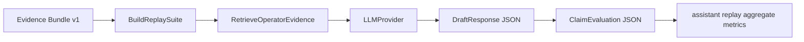

# assistant replay Assistant Harness

The assistant replay harness preserves the thesis-style assistant experiment while moving it
behind clean ports and repositories. Operator cards remain optional rendering
artifacts; assistant replay metrics come from replay suites, retrieval, provider-backed
structured planning, structured referee checks, and deterministic metric
aggregation.

## Flow



Each case is built from evidence rows. The query template receives
`dataset`, `run_id`, `event_id`, and `top_variables`. Retrieval ranks evidence
bundle chunks and optional local Markdown playbooks. The planner prompt and
`DraftResponse` schema mirror the thesis assistant surface: symptom summary,
likely causes, checks, recommended actions, and escalation criteria. Code then
extracts claims, assigns retrieved citations deterministically, and asks the
referee to return `ClaimEvaluation` JSON for each claim. Metrics are derived
from those structured artifacts, not from operator-card rendering.

## Metrics

The summary preserves thesis-compatible proxy keys:

- `supported_claims`
- `citation_compliant_claims`
- `propositional_alignment_proxy`
- `citation_compliance_proxy`
- `verified_response_safety_proxy`
- `abstain_rate`
- `retrieval_expectation_hit_rate`
- `document_grounding_coverage_proxy`
- `evidence_pack_overflow_count`
- `budget_truncation_count`

## Artifacts

```text
<assistant_out>/
  preflight.json
  resolved_config.json
  cases/
  suites/
  runs/<case_id>/
    case_spec.json
    retrieval_result.json
    provider_request.json
    provider_response.json
    planner_output.json
    referee_output.json
    run_log.json
    rendered_response.md
  assistant_summary.json
  assistant_summary.csv
```

Run directly:

```powershell
itse assistant run --config config/reproduction.toml --benchmark out/repro/smoke/benchmark --evidence out/repro/smoke/evidence/opcua__forecast-ridge-smoke__naive --out out/assistant
itse assistant summarize --run out/assistant
```
