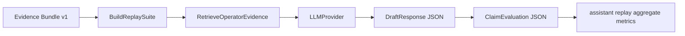
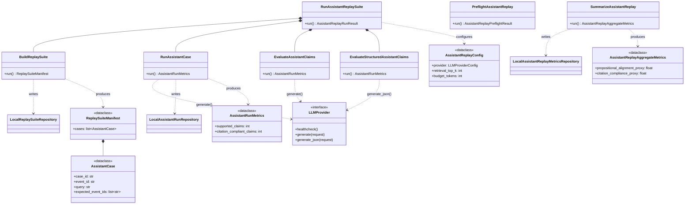

# assistant replay Assistant Harness

The assistant replay harness preserves the thesis-style assistant experiment while moving it
behind clean ports and repositories. Operator cards remain optional rendering
artifacts; assistant replay metrics come from replay suites, retrieval, provider-backed
structured planning, structured referee checks, and deterministic metric
aggregation. The orchestrating use case is `RunAssistantReplaySuite`
(`src/industrial_tsad_eval/application/assistant_replay.py:533`), which
composes `BuildReplaySuite` (`:169`), `RunAssistantCase` (`:222`),
`EvaluateAssistantClaims` (`:439`), and `EvaluateStructuredAssistantClaims`
(`:343`). Readiness is checked by `PreflightAssistantReplay` (`:123`); summaries
are produced by `SummarizeAssistantReplay` (`:663`).

## Flow



Each case is built from evidence rows (`AssistantCase`,
`src/industrial_tsad_eval/domain/assistant_replay.py:139`). The query template
receives `dataset`, `run_id`, `event_id`, and `top_variables`. Retrieval ranks
evidence bundle chunks and optional local Markdown playbooks. The planner
prompt and `DraftResponse` schema (`domain/assistant_replay.py:25`) mirror the
thesis assistant surface: symptom summary, likely causes, checks, recommended
actions, and escalation criteria. Code then extracts claims (`DraftClaim`,
`:37`), assigns retrieved citations deterministically, and asks the referee to
return `ClaimEvaluation` (`:48`) JSON for each claim. Metrics are derived from
those structured artifacts, not from operator-card rendering, and aggregated by
`aggregate_assistant_metrics` (`:278`).

## Metrics

Per-run metrics use `AssistantRunMetrics`
(`src/industrial_tsad_eval/domain/assistant_replay.py:194`); suite-level
aggregates use `AssistantReplayAggregateMetrics` (`:222`). The summary
preserves thesis-compatible proxy keys:

- `supported_claims`
- `citation_compliant_claims`
- `propositional_alignment_proxy`
- `citation_compliance_proxy`
- `verified_response_safety_proxy`
- `abstain_rate`
- `retrieval_expectation_hit_rate`
- `document_grounding_coverage_proxy`
- `evidence_pack_overflow_count`
- `budget_truncation_count`

## Artifacts

```text
<assistant_out>/
  preflight.json
  resolved_config.json
  cases/
  suites/
  runs/<case_id>/
    case_spec.json
    retrieval_result.json
    provider_request.json
    provider_response.json
    planner_output.json
    referee_output.json
    run_log.json
    rendered_response.md
  assistant_summary.json
  assistant_summary.csv
```

Suite manifests are written by `LocalReplaySuiteRepository`
(`src/industrial_tsad_eval/infrastructure/assistant_replay_repository.py:19`);
per-case run artifacts by `LocalAssistantRunRepository` (`:50`); aggregate
metrics by `LocalAssistantReplayMetricsRepository` (`:82`).

Run directly:

```powershell
itse assistant run --config config/reproduction.toml --benchmark out/repro/smoke/benchmark --evidence out/repro/smoke/evidence/opcua__forecast-ridge-smoke__naive --out out/assistant
itse assistant summarize --run out/assistant
```

## Class Diagram

The diagram below shows the static structure of the assistant-replay slice: the
orchestrator, its sub-services, the provider port, the domain value types, and
the three repositories that persist the suite, runs, and metrics.



Box locations:
`RunAssistantReplaySuite` (`application/assistant_replay.py:533`),
`BuildReplaySuite` (`:169`), `RunAssistantCase` (`:222`),
`EvaluateAssistantClaims` (`:439`), `EvaluateStructuredAssistantClaims` (`:343`),
`PreflightAssistantReplay` (`:123`), `SummarizeAssistantReplay` (`:663`),
`LLMProvider` (`ports/llm.py:18`),
`AssistantReplayConfig` (`domain/assistant_replay.py:61`),
`AssistantCase` (`:139`), `ReplaySuiteManifest` (`:177`),
`AssistantRunMetrics` (`:194`), `AssistantReplayAggregateMetrics` (`:222`),
`LocalReplaySuiteRepository` (`infrastructure/assistant_replay_repository.py:19`),
`LocalAssistantRunRepository` (`:50`),
`LocalAssistantReplayMetricsRepository` (`:82`).
