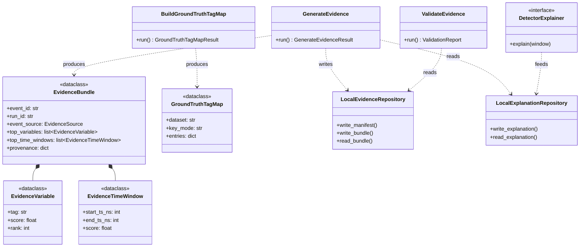

# Evidence Bundles

Evidence Bundle v1 is the explanation boundary artifact for one oracle or
operational event. It can be built from detector-native explanation artifacts
when available, or from the deterministic robust baseline. The dataclass is
`EvidenceBundle` (`src/industrial_tsad_eval/domain/evidence.py:44`); the use
cases are `GenerateEvidence` (`application/evidence.py:121`) and
`ValidateEvidence` (`application/evidence.py:208`); writes go through
`LocalEvidenceRepository` (`infrastructure/evidence_repository.py:13`).

```powershell
itse evidence generate --prepared examples/generated/OPCUA_SYNTH --scores out/scores --out out/evidence
itse evidence validate --prepared examples/generated/OPCUA_SYNTH --evidence out/evidence
```

Operational evidence consumes event matches from an evaluation directory:

```powershell
itse evidence generate --prepared examples/generated/OPCUA_SYNTH --scores out/scores --eval out/eval --event-source operational --out out/evidence-operational
```

By default, `explanation_source=auto` uses native explanation artifacts from
`scores/explanations/` (written through `LocalExplanationRepository`,
`infrastructure/explanation_repository.py:16`) when a detector produced them,
then falls back to robust train/validation z-score deviation. Use
`explanation_source=native` when a run must fail if native artifacts are
missing, or `explanation_source=robust` for the detector-agnostic baseline.

Native explanations are produced by detectors implementing the
`DetectorExplainer` port (`ports/detectors.py:33`): DRA
(`plugins/torch_detectors.py:271`) writes residual-gradient saliency,
InterFusion (`:402`) writes Monte Carlo reconstruction/imputation attribution,
and DRCAD (`:516`) writes counterfactual reconstruction deltas. Forecast Ridge
remains on the robust baseline.

## Layout

```text
<evidence_out>/
  manifest.json
  index.jsonl
  bundles/<safe_run_id>/<safe_event_id>/evidence.json
```

Each bundle records event identity, source, matched GT event when available,
top variables (`EvidenceVariable`, `domain/evidence.py:16`), top time windows
(`EvidenceTimeWindow`, `:30`), score context, local rankings, and provenance.
The provenance records whether native or robust evidence was used and which
explainer method produced the rankings.

Ground-truth tag maps consumed by XAI evaluation use `GroundTruthTagMap`
(`domain/evidence.py:156`), built by `BuildGroundTruthTagMap`
(`application/evidence.py:252`) and validated by `ValidateGroundTruthTagMap`
(`application/evidence.py:283`).

## Class Diagram

The diagram below shows the static structure of the evidence slice: the
orchestrating use case, the value types that make up a bundle, the
repositories that persist it, and the explainer port that feeds native
explanations.



Lines for the boxes:
`GenerateEvidence` (`application/evidence.py:121`),
`ValidateEvidence` (`:208`), `BuildGroundTruthTagMap` (`:252`),
`EvidenceBundle` (`domain/evidence.py:44`),
`EvidenceVariable` (`:16`), `EvidenceTimeWindow` (`:30`),
`GroundTruthTagMap` (`:156`),
`LocalEvidenceRepository` (`infrastructure/evidence_repository.py:13`),
`LocalExplanationRepository` (`infrastructure/explanation_repository.py:16`),
`DetectorExplainer` (`ports/detectors.py:33`).
