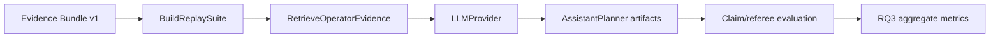

# RQ3 Assistant Harness

The RQ3 harness preserves the thesis-style assistant experiment while moving it
behind clean ports and repositories. Operator cards remain optional rendering
artifacts; RQ3 metrics come from replay suites, retrieval, provider-backed
planning, and deterministic referee checks.

## Flow



Each case is built from evidence rows. The query template receives
`dataset`, `run_id`, `event_id`, and `top_variables`. Retrieval ranks evidence
bundle chunks and optional local Markdown playbooks. The provider response is
split into cited claims, and the referee marks claims supported only when their
citations resolve to retrieved evidence.

## Metrics

The summary preserves thesis-compatible proxy keys:

- `supported_claims`
- `citation_compliant_claims`
- `propositional_alignment_proxy`
- `citation_compliance_proxy`
- `verified_response_safety_proxy`
- `abstain_rate`
- `retrieval_expectation_hit_rate`
- `document_grounding_coverage_proxy`
- `evidence_pack_overflow_count`
- `budget_truncation_count`

## Artifacts

```text
<rq3_out>/
  preflight.json
  resolved_config.json
  cases/
  suites/
  runs/<case_id>/
    case_spec.json
    retrieval_result.json
    provider_request.json
    provider_response.json
    planner_output.json
    referee_output.json
    run_log.json
    rendered_response.md
  rq3_summary.json
  rq3_summary.csv
```

Run directly:

```powershell
itse rq3 run --config config/reproduction.toml --benchmark out/repro/smoke/benchmark --evidence out/repro/smoke/evidence/opcua__forecast-ridge-smoke__naive --out out/rq3
itse rq3 summarize --run out/rq3
```
